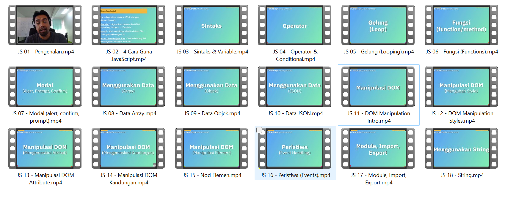

# Kod Sisipan Kursus Online JavaScript Sepintas Lalu

Ini adalah kod sisipan daripada **Kursus Online JavaScript Sepintas Lalu** yang dibawakan oleh KelasProgramming.com.

Kursus ini disampaikan oleh Khairil Iszuddin dalam bahasa Melayu.

Kursus ini merangkumi topik-topik berikut : 

* Pengenalan
* Sintaks
* Pembolehubah
* Array
* Objek
* JSON
* Manipulasi DOM
dan pelbagai lagi.

Daftar di https://kelasprogramming.com/register untuk mendapat akses kepada kursus online video berdurasi 3 jam dan 40 minit.
